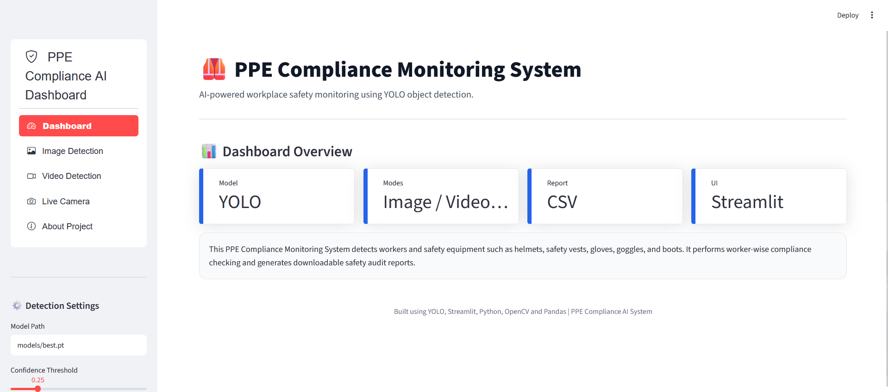
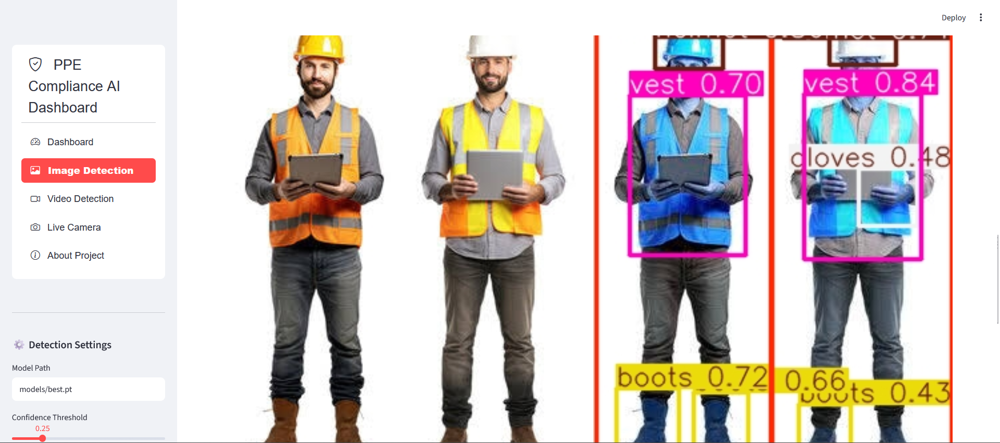
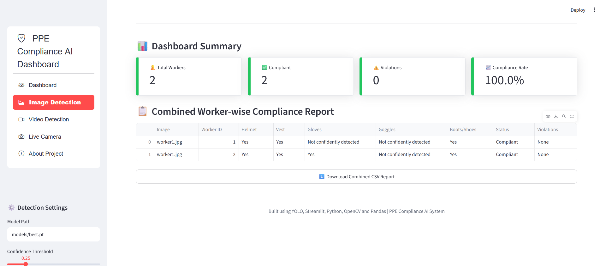
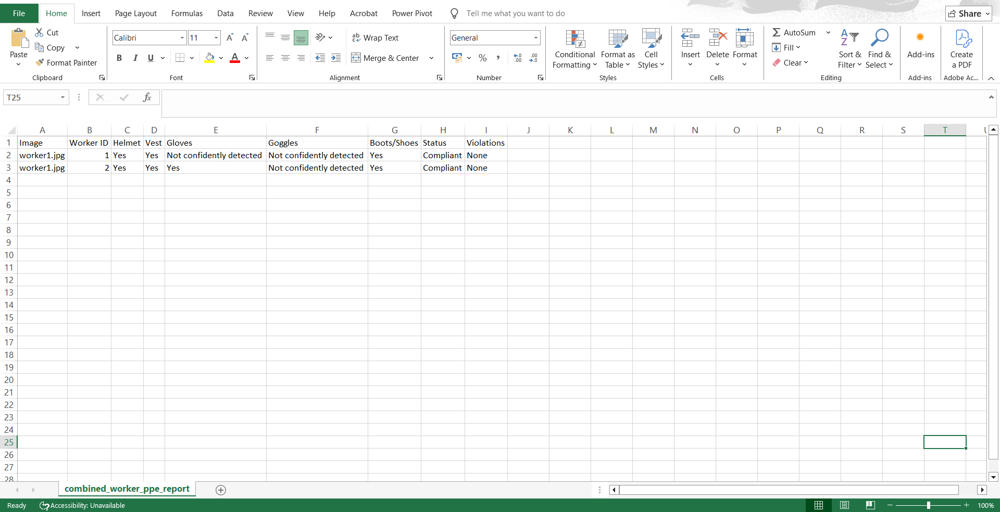
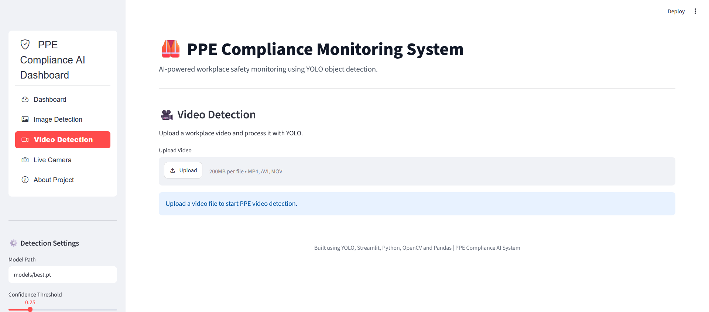
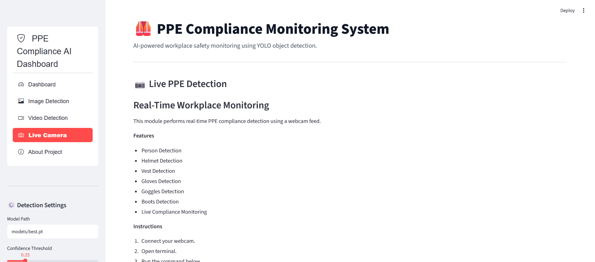

# PPE Compliance Monitoring System

## Overview

The PPE Compliance Monitoring System is a Computer Vision application developed using YOLO and Streamlit to monitor workplace safety. The system detects workers and Personal Protective Equipment (PPE) such as helmets, safety vests, gloves, goggles, and boots, and generates worker-wise compliance reports.

## Features

* Real-time PPE detection using YOLO
* Worker detection and PPE assignment
* Helmet, Vest, Gloves, Goggles, and Boots detection
* Worker-wise compliance analysis
* Automated CSV report generation
* Image inference support
* Video inference support
* Streamlit dashboard for easy interaction

## Tech Stack

* Python
* YOLO (Ultralytics)
* OpenCV
* Pandas
* Streamlit
* NumPy

## Project Structure

```text
PPE-Compliance-System/
│
├── app.py
├── detect_image.py
├── detect_video.py
├── ppe_matcher.py
├── requirements.txt
├── README.md
│
├── models/
│   └── best.pt
│
├── input/
│   ├── images/
│   └── videos/
│
├── output/
│   ├── reports/
│   └── videos/
│
└── screenshots/
```

## Workflow

1. Upload an image or video.
2. YOLO detects workers and PPE equipment.
3. PPE items are assigned to the corresponding worker.
4. Compliance rules are applied.
5. Worker-wise reports are generated.
6. Results are displayed through the Streamlit dashboard.

## Results

The system successfully:

* Detects workers and PPE equipment using YOLO.
* Assigns PPE items to individual workers.
* Performs worker-wise compliance analysis.
* Generates downloadable CSV safety reports.
* Supports image, video, and real-time monitoring workflows.

## How to Run

### Install Dependencies

```bash
pip install -r requirements.txt
```

### Run Image Detection

```bash
python detect_image.py
```

### Run Video Detection

```bash
python detect_video.py
```

### Run Streamlit Dashboard

```bash
streamlit run app.py
```

## Sample Output

* Detected PPE bounding boxes
* Worker-wise compliance table
* CSV compliance report

## Screenshots

### Dashboard


### Image Detection


### Compliance Report


### Downloadable CSV File


### Video Detection


### Live Camera Detection


## Future Improvements

* Real-time webcam monitoring
* CCTV/IP camera integration
* PPE tracking across frames
* Cloud deployment
* Alert notification system

## Author

**Dona Rose**

Aspiring AI/ML Engineer with experience in Computer Vision, Machine Learning, Generative AI, and Data Science.

GitHub: https://github.com/dopymol


